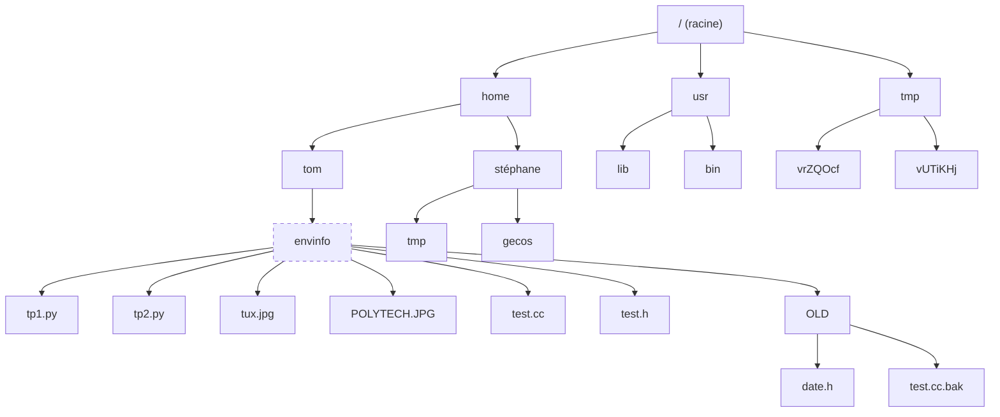
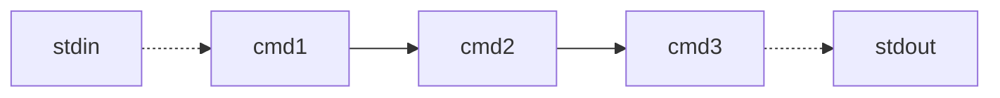

## TD 1 : fichiers, stockage, codage

## Exercice 1 : bits et octets

Les préfixes usuels en informatique sont :

- l'octet, « 1 o » pour une suite de 8 bits,
- le kibioctet, « 1 kio » pour une suite de $2^{10} = 1024 \approx 10^3$ octets,
- le mébioctet, « 1 Mio » pour une suite de $2^{10}$ kibioctets,
- le gibioctet, « 1 Gio » pour une suite de $2^{10}$ mébioctets,
- le tébioctet, « 1 Tio » pour une suite de $2^{10}$ gibioctets,
- ... (les valeurs au-delà sont rarement rencontrées...)

> [!NOTE]
> Par abus de langage, on dit souvent « kilo », « méga », ... pour désigner ces préfixes à base de puissances de 2. Mais formellement, il s’agit bien d’unités différentes. Les unités binaires (kibi, mébi, …) sont celles utilisés par les informaticiens au quotidien.
>
> Au niveau des OS courants,
> - Windows compte en base 2 et affiche en base 10 ("1 KB" = 1024 octets),
> - Linux compte en base 2 et affiche en base 2 ("1 KiB" = 1024 octets),
> - macOS compte en base 10 et affiche en base 10 ("1 KB" = 1000 octets).

### Question 1

Donnez le nombre d'octets dans 1 Mio, 1 Gio et 1 Tio.

### Question 2

Un kilooctet (1 ko) fait *exactement* 1000 octets alors qu'un kibioctet fait *approximativement* 1000 octets. Un kibioctet a donc 2,4 % d'octets en plus qu'un kilooctet.

De même, téraoctet (1 To) fait *exactement* $10^{12}$ octets alors qu'un tébioctet fait *approximativement* $10^{12}$ octets.

Pour induire en erreur le consommateur, les vendeurs de disques durs donnent systématiquement les unités en base 10 (kilo, méga, ...). Si un disque est annoncé comme ayant 1 To, quelle est sa capacité en unités binaires ?

## Exercice 2 : fichiers, chemins et motifs

### Question 1

Qu'est-ce qu'un *fichier binaire* ? Donnez quelques exemples.

> [!NOTE]
> Une façon simple de savoir si un fichier est binaire ou texte est simplement de... l'ouvrir dans un éditeur de texte. Vous pouvez utiliser `nano` en ligne de commande, ou un éditeur graphique comme `gedit` ou `kate` depuis l'interface graphique.

Qu'est-ce qu'un fichier texte *structuré* ? Donnez quelques exemples de formats de fichiers texte structurés.

> [!NOTE]
> Si vous manquez d'idées de types de fichiers, baladez-vous par exemple dans /boot, /etc, C:\Windows, ou testez avec vos fichiers personnels !


### Question 2

Qu'est-ce qu'un chemin d'accès ? Quelles différences y a t'il entre un chemin *absolu* et un chemin *relatif* ?

### Question 3

Voici un morceau d'une arborescence de fichiers Unix : (`envinfo` est le répertoire courant)



Donnez des chemins absolus et relatifs pour accéder aux répertoires `OLD`, `tom`, `envinfo`, `vrZQOcf` et `tmp`.

### Question 4

Pour chacun des motifs shell suivants, donnez la liste des fichiers correspondants dans l'arborescence ci dessus. (`envinfo` est le répertoire courant)

|||
|---|---|
| `*.py` | `*.?/*h` |
| `*.?` | `*.*` |
| `*[ch]` | `*/*?k` |

## Exercice 3 : shell et composition (POSIX)

*Rappels :*

```sh
$ CMD1 | CMD2 | CMD3
```

permet :

- de lancer la commande `CMD1`,
- de faire agir `CMD2` sur la sortie de `CMD1`,
- de faire agir `CMD3` sur la sortie de `CMD2`.

On pourrait visualiser ceci par :



Durant ce TD, des cas de figures fictifs vous seront présentés. Cela ne vous empêche pas (d'ailleurs, vous devriez !) de faire des tests sur votre machine pour vérifier vos intuitions sur le comportement des commandes. Je vous encourage notamment à construire vous-même des jeux d'exemples, par exemple créer des fichiers texte dans votre dossier personnel pour tester les commandes dessus. **C'est en faisant que vous apprendrez !**

> [!NOTE]
> La commande `wc -l` permet de compter le nombre de lignes :
> 
> - dans des fichiers si des chemins d’accès sont donnés avec la commande (`wc -l tp1.py` par exemple),
> - sur l’entrée *standard* si aucun chemin n’est donné.

### Question 1

Imaginons que le répertoire courant contienne les fichiers `cours.md`, `cours.html`, `tp1.html`, `examen.pdf` et `liste_etudiants.html`.

Quel serait le résultat des commandes suivantes ?

```sh
$ ls | wc -l
$ ls *.html | wc -l | wc -l
$ wc -l examen.pdf | ls *.pdf
```

Pour répondre à cela, jouez un peu avec la commande `wc` pour voir comment elle se comporte. Le but n'est pas que vous lanciez les commanes ci-dessus, mais que vous ayez une suffisamment bonne intuition pour prédire/décrire leur sortie !

### Question 2

> [!NOTE]
> La commande `grep CHAINE` permet d’afficher les lignes contenant la chaîne de caractères `CHAINE` sur la sortie standard. Si des noms de fichiers sont donnés, la recherche se fait dans les lignes de ces fichiers ; si aucun nom de fichier n’est donné, la recherche des lignes se fait sur l’entrée standard.

Comment peut-on compter le nombre de lignes contenant la chaîne `TODO` dans tous les fichiers `.html` du répertoire courant ?

### Question 3

> [!NOTE]
> - La commande `sort` permet de trier les lignes de l’entrée standard (ou de fichiers, si des noms sont donnés à la commande) et de les afficher sur la sortie standard. L’option `-n` permet de faire un tri numérique plutôt qu’alphabétique. (Pour le tri alphabétique, 10 vient avant 2 !)
> - La commande `uniq` permet de supprimer les lignes identiques *consécutives* de l’entrée standard (ou d’un fichier, si un chemin d’accès est donné avec la commande) et d’afficher le résultat sur la sortie standard. L’option `-c` permet de préfixer chaque ligne du résultat avec le nombre d’occurrences consécutives de la ligne.
> - Les commandes `head` et `tail` permettent d’afficher uniquement les 10 premières ou dernières lignes de l’entrée standard (ou d’un fichier si un chemin est donné avec la commande).

Comment peut-on afficher la liste des lignes du fichier `test.txt` en supprimant **tous** les doublons (lignes identiques). L’ordre des lignes affichées n’a pas besoin d’être identique à l’ordre des lignes dans le fichier.

Comment peut-on afficher la liste des 10 lignes qui apparaissent le plus souvent dans le fichier `test.txt`. (Les lignes affichées peuvent contenir le nombre d’occurrences dans le fichier.)

### Question 4

> [!NOTE]
> - L’option `-l` de la commande `grep` permet de seulement afficher le nom des fichiers qui contiennent au moins une ligne contenant la chaîne donnée.
> - La commande `xargs CMD` lit une liste de fichiers (chemins d’accès) `FICHIER1 ... FICHIERn` sur l’entrée standard et exécute ensuite la commande `CMD FICHIER1 ... FICHIERn`.

Comment peut-on supprimer tous les fichiers du répertoire courant qui contiennent la chaîne `version-0` ?

### Question 5

La commande `find -size +1k -type f` permet d’afficher les noms de tous les fichiers (`-type f`) dont la taille est supérieure à 1Kio (`-size +1k`), dans tous les dossiers, sous-dossiers, etc.

Comment peut-on, à partir de cette commande et des commandes vues précédemment :

- obtenir le nombre de fichiers dont la taille est supérieure à 1Kio,
- obtenir le nombre de lignes contenant la chaîne `TODO` dans tous ces fichiers,
- obtenir le nombre de fichiers de plus de 1Kio contenant la chaîne `TODO`.

## Exercice 4 : GameShell

Cette section a pour objectif de vous faire pratiquer l'usage du shell. Elle se base sur un "serious game" appelé GameShell, développé par Pierre Hyvernat de l'USMB.

Rappels de vocabulaire :
-  **terminal** : le programme **graphique** permettant d'exécuter d'autres programmes en ligne de commande (en mode texte, donc), et d'afficher leur sortie. Il est parfois appelé "console" ou "invite de commandes".
-  **shell** : le programme interprétant les commandes tapées dans le terminal. Conceptuellement, un shell simple ressemble à :
  ```py
  while True:
    commande = lire_une_commande()
    executer(commande)
  ``` 
- **commande** : peut désigner un programme exécutable quelconque qui effectue une action, ou par abus de langage, l'action elle-même. Par exemple, `ls` est une commande qui permet d'afficher la liste des fichiers dans un répertoire. Mais on dira parfois que `ls -l bidule` est aussi une commande qui liste en format long les éléments du dossier `bidule`.

Pour lancer GameShell, ouvrez un terminal (et mettez la fenêtre en plein écran), puis lancez :
```sh
$ sudo apt -y install gettext man-db procps psmisc nano tree ncal x11-apps wget
$ wget https://github.com/phyver/GameShell/releases/download/latest/gameshell.sh
$ bash gameshell.sh -L fr
```

> [!IMPORTANT]
> Il ne faut **pas** recopier les `$`. Copiez chaque commande individuellement.
>
> La première commande (`sudo apt install ...`) vous demandera le mot de passe. C'est le mot de passe qui vous sert à vous connecter (`pns`). Quand vous le taperez, il ne **s'affichera pas** dans le terminal, c'est normal, c'est par sécurité !

### Déroulement du jeu

Vous allez maintenant devoir remplir un certain nombre de *missions* en utilisant le shell. Ces missions vous permettront de vous familiariser avec certaines commandes. Toutes les commandes que vous utiliserez seront des commandes standard du shell disponibles depuis n'importe quelle version de Linux. Les seules commandes spécifiques à ce TP sont celles qui commencent par le mot clé `gsh` :

- `gsh goal` qui affiche l'objectif de la mission courante,
- `gsh check` qui vérifie si votre mission courante est validée,
- `gsh exit` qui sauvegarde votre avancement et quitte le jeu.

La commande `gsh help` vous permet d'afficher cette liste de commandes, ainsi que quelques autres.

Il est important de garder à l'esprit que les "missions" sont simplement des tâches que l'on rencontre couramment lors de l'utilisation d'un ordinateur :

- créer des répertoires
- créer des fichiers
- chercher des fichiers selon des critères simples ou complexes
- lancer ou arrêter d'autre programmes

...

Dans GameShell, les "objets" que vous rencontrerez sont simplement des fichiers standard (souvent avec un contenu aléatoire) et les "lieux" que vous visiterez sont simplement des répertoires. Ainsi, "construire une cabane" revient simplement à créer un répertoire, et "mettre les pièces dans le coffre" revient simplement à déplacer les fichiers "pièce" dans le répertoire "coffre".

Pour cette première séance, le but est simplement que vous avanciez autant que possible dans les missions.